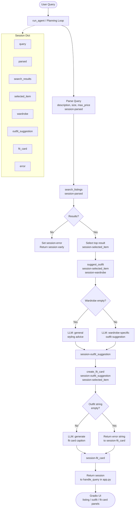

# FitFindr — planning.md

> Complete this document before writing any implementation code.
> Your spec and agent diagram are what you'll use to direct AI tools (Claude, Copilot, etc.) to generate your implementation — the more specific they are, the more useful the generated code will be.
> Your planning.md will be reviewed as part of your submission.
> Update it before starting any stretch features.

---

## Tools

List every tool your agent will use. For each tool, fill in all four fields.
You must have at least 3 tools. The three required tools are listed — add any additional tools below them.

### Tool 1: search_listings

**What it does:**
<!-- Describe what this tool does in 1–2 sentences -->
this tool describes what the customer is looking for. it is suppose to search our listings data and returns a list of items that match the user's criteria

**Input parameters:**
<!-- List each parameter, its type, and what it represents -->
- `description` (str): A natural-language description of the item
- `size` (str): The user's clothing size
- `max_price` (float): The maximum price the user is willing to pay

**What it returns:**
<!-- Describe the return value — what fields does a result contain? -->
A list of matching listing objects, each with fields like: title, price, size, category, image_url, and listing_id

**What happens if it fails or returns nothing:**
<!-- What should the agent do if no listings match? -->
The agent tells the user no listings matched and asks them to broaden their search. Something like, "raise the price", "try a different size", or "use a more general description."

---

### Tool 2: suggest_outfit

**What it does:**
<!-- Describe what this tool does in 1–2 sentences -->
The tool takes an the item the user has found/decided on and, in conjunction with the user's wardrobe, it suggests a complete outfit by pairing the new item with pieces the user already owns that look good, nice, cute? I dunno

**Input parameters:**
<!-- List each parameter, its type, and what it represents -->
- `new_item` (dict): The listing the user selected from search results generated in tool 1, search-listing.py
- `wardrobe` (dict): A wardrobe object matching the schema in the data folder; contains an items array where each item has id, name, category, colors, style_tags, and optionally notes.

**What it returns:**
<!-- Describe the return value -->
An outfit object with fields like top, bottom, shoes, and optionally accessories — each referencing either the new item or a wardrobe piece. Could also include a short style_note explaining why the pieces work together.

**What happens if it fails or returns nothing:**
<!-- What should the agent do if the wardrobe is empty or no outfit can be suggested? -->
If the wardrobe is empty/matches the empty wardrobe template in the wardrobe_schema.json, the agent skips pairing and suggests a generic outfit based on common styles that match the new item (e.g. "pairs well with straight-leg jeans and white sneakers"). If the tool errors, the agent returns just the listing with a note that styling isn't available.

---

### Tool 3: create_fit_card

**What it does:**
<!-- Describe what this tool does in 1–2 sentences -->
takes a suggested outfit and the new listing item, and generates a formatted fit card. According to the project description, "the kind of thing someone would caption an Instagram post with." Produces something different each time for different inputs.

**Input parameters:**
<!-- List each parameter, its type, and what it represents -->
- `outfit` (str): The outfit suggestion from suggest_outfit.py
- `new_item` (dict): The listing selected by the user with these fields: id, title, price, condition, platform, colors, style_tags.

**What it returns:**
<!-- Describe the return value -->
A fit card with:

headline (str): e.g. "Graphic Tee + Dark Denim"
items_list (list): Each piece with its name and source ("new listing" or "your wardrobe")
style_note (str): 1–2 sentence vibe description that theoretically matches a instagram model's post.
listing_link (str): The listing's id and platform so the user knows where to buy it (e.g. "lst_006 on depop")

**What happens if it fails or returns nothing:**
<!-- What should the agent do if the outfit data is incomplete? -->
If the outfit data is incomplete such as in the case that suggest_outfit returned nothing, the agent creates a minimal fit card showing just the new listing with its details, and omits the styling section rather than crashing.

---

### Additional Tools (if any)

<!-- Copy the block above for any tools beyond the required three -->

---

## Planning Loop

**How does your agent decide which tool to call next?**
<!-- Describe the logic your planning loop uses. What does it look at? What conditions change its behavior? How does it know when it's done? -->
Updated Planning Loop
The agent runs sequentially through the session dict defined in _new_session(). Here's the logic step by step:

Initialize: run_agent() calls _new_session() to create the session dict with query, parsed, search_results, selected_item, wardrobe, outfit_suggestion, fit_card, and error all set to their defaults.

Parse query: The agent parses the raw query string to extract description, size, and max_price. These are stored in session["parsed"]. A regex or LLM call can handle this — e.g. scanning for a dollar amount for max_price, a size token like "size M" for size, and treating the remainder as description.

Call search_listings: Uses session["parsed"] as input. Results stored in session["search_results"]. If the list is empty, session["error"] is set to a helpful message (e.g. "No listings matched — try a higher price or different size.") and the function returns early. Nothing else runs.

Select item: The agent picks session["search_results"][0] (top relevance-scored result) and stores it in session["selected_item"].

Call suggest_outfit: Takes session["selected_item"] and session["wardrobe"] as inputs. Result stored in session["outfit_suggestion"]. If the wardrobe is empty, the tool handles it gracefully and still returns a string — the loop does not branch here.

Call create_fit_card: Takes session["outfit_suggestion"] and session["selected_item"]. Result stored in session["fit_card"]. If outfit_suggestion is empty, the tool returns a descriptive error string rather than raising — the loop still completes.

Return session: The full session dict is returned to the caller (app.py's handle_query()), which maps session["selected_item"], session["outfit_suggestion"], and session["fit_card"] to the three Gradio output panels.

---

## State Management

**How does information from one tool get passed to the next?**
<!-- Describe how your agent stores and accesses state within a session. What data is tracked? How is it passed between tool calls? -->
All state lives in the session dict created by _new_session() at the start of each run_agent() call. Nothing persists between runs — every interaction starts fresh.

Step 1 — Session is initialized:
run_agent() calls _new_session(query, wardrobe). This sets up the session dict with all keys pre-populated to their defaults. The wardrobe is loaded before this point by handle_query() in app.py using either get_example_wardrobe() or get_empty_wardrobe() from data_loader.py, and passed straight in.

Step 2 — Query is parsed:
The raw session["query"] string is parsed to extract description, size, and max_price. The result is stored as a dict in session["parsed"]. Nothing else reads from session["query"] after this point.

Step 3 — Search results are stored:
search_listings() is called with the values from session["parsed"]. Its return value — a list of matching listing dicts — is stored in session["search_results"]. If the list is empty, session["error"] is set and the function returns immediately; no further keys are written.

Step 4 — Top result is selected:
The agent picks session["search_results"][0] and writes it to session["selected_item"]. This single listing dict is the value that both downstream tools depend on.

Step 5 — Outfit suggestion is stored:
suggest_outfit() is called with session["selected_item"] and session["wardrobe"]. Its string return value is stored in session["outfit_suggestion"].

Step 6 — Fit card is stored:
create_fit_card() is called with session["outfit_suggestion"] and session["selected_item"]. Its string return value is stored in session["fit_card"].

Step 7 — Session is returned:
The completed session dict is returned to handle_query() in app.py, which maps session["selected_item"], session["outfit_suggestion"], and session["fit_card"] to the three Gradio output panels.

---

## Error Handling

For each tool, describe the specific failure mode you're handling and what the agent does in response.

| Tool | Failure mode | Agent response |
|------|-------------|----------------|
| search_listings | No results match the query |Sets session["error"] to a helpful message (e.g. "No listings matched — try a higher price, different size, or broader description.") and returns the session immediately. suggest_outfit and create_fit_card are never called. |
| suggest_outfit | Wardrobe is empty |Tool handles it internally — calls the Groq LLM for general styling advice instead of wardrobe-specific pairings. Always returns a non-empty string, so the planning loop never branches here. |
| create_fit_card | Outfit input is missing or incomplete |Tool handles it internally — returns a descriptive error string rather than raising an exception. The session still completes and session["fit_card"] is set. |

---

## Architecture

<!-- Draw a diagram of your agent showing how the components connect:
     User input → Planning Loop → Tools (search_listings, suggest_outfit, create_fit_card)
                                                                          ↕
                                                                   State / Session
     Show what triggers each tool, how state flows between them, and where error paths branch off.
     Use ASCII art or a Mermaid diagram (https://mermaid.js.org/syntax/flowchart.html).
     Do NOT embed an image — graders need to read your diagram directly in the file;
     an embedded image or screenshot cannot be evaluated.
     You'll share this diagram with an AI tool when asking it to implement
     the planning loop and each individual tool. -->

---

## AI Tool Plan

<!-- For each part of the implementation below, describe:
     - Which AI tool you plan to use (Claude, Copilot, ChatGPT, etc.)
     - What you'll give it as input (which sections of this planning.md, your agent diagram)
     - What you expect it to produce
     - How you'll verify the output matches your spec before moving on

     "I'll use AI to help me code" is not a plan.
     "I'll give Claude my Tool 1 spec (inputs, return value, failure mode) and ask it to implement
     search_listings() using load_listings() from the data loader — then test it against 3 queries
     before trusting it" is a plan. -->

**Milestone 3 — Individual tool implementations:**

Tool 1 — search_listings:

I'll give Claude the Tool 1 spec from planning.md (inputs, return value, failure mode) and the field list from listings.json, and ask it to implement search_listings() using load_listings() from data_loader.py. I'll verify by testing three queries manually: one that should return results, one with a price too low to match anything, and one with a size that filters everything out.

Tool 2 — suggest_outfit:

I'll give Claude the Tool 2 spec, the wardrobe schema from wardrobe_schema.json, and the suggest_outfit() function signature from tools.py, and ask it to implement the function using the Groq client. I'll verify by running it once with the example wardrobe and once with the empty wardrobe, confirming both return a non-empty string.

Tool 3 — create_fit_card:

I'll give Claude the Tool 3 spec, a sample listing dict from listings.json, and the style guidelines in the create_fit_card() docstring, and ask it to implement the function using the Groq client at a higher temperature. I'll verify by running it with a real outfit string and confirming the caption mentions the item name, price, and platform exactly once each.

**Milestone 4 — Planning loop and state management:**
I'll give Claude the completed Planning Loop and State Management sections from planning.md, the full agent.py starter file, and the Architecture diagram, and ask it to implement run_agent() following the 7 TODO steps in the docstring. I'll verify using the two CLI tests already in agent.py — the happy path with a graphic tee query and the no-results path with the ballgown query — confirming the happy path returns a fit card and the no-results path sets session["error"].

---

## A Complete Interaction (Step by Step)

Write out what a full user interaction looks like from start to finish — tool call by tool call. Use a specific example query.

**Example user query:** "I'm looking for a vintage graphic tee under $30. I mostly wear baggy jeans and chunky sneakers. What's out there and how would I style it?"

**Step 1:**
<!-- What does the agent do first? Which tool is called? With what input? -->
The agent parses the query and extracts: description = "vintage graphic tee", size = None (no size specified), max_price = 30.0. It calls search_listings(description="vintage graphic tee", size=None, max_price=30.0). The tool loads listings.json, filters to items under $30, scores each by keyword overlap with "vintage graphic tee" against titles, descriptions, and style tags, and returns a ranked list. The top result is lst_006 — "Graphic Tee — 2003 Tour Bootleg Style", $24, size L, on depop.

**Step 2:**
<!-- What happens next? What was returned from step 1? What tool is called now? -->
The agent stores lst_006 as session["selected_item"] and calls suggest_outfit(new_item=lst_006, wardrobe=example_wardrobe). The wardrobe is not empty, so the tool formats the 10 wardrobe items into a prompt and asks the Groq LLM to suggest specific outfit combinations using the graphic tee and named wardrobe pieces. The LLM returns something like: "Pair the bootleg tee with your baggy straight-leg jeans (w_001) and chunky white sneakers (w_007) for a classic streetwear look. For a grungier take, try it with your black combat boots (w_008) and vintage denim jacket (w_006)."

**Step 3:**
<!-- Continue until the full interaction is complete -->
The agent calls create_fit_card(outfit=session["outfit_suggestion"], new_item=lst_006). The tool builds a prompt with the item details and outfit suggestion and asks the Groq LLM to write a casual 2–4 sentence OOTD caption. The LLM returns something like: "Found this faded bootleg tee on depop for $24 and it's already my new favorite. Styled it with baggy dark wash jeans and chunky sneakers — pure 90s streetwear energy. Condition is good and honestly the worn-in look makes it better. Grab it before someone else does."

**Final output to user:**
<!-- What does the user actually see at the end? -->
The Gradio UI displays three panels: the top listing panel shows lst_006's title, price, condition, size, and platform; the outfit idea panel shows the LLM's wardrobe-specific pairing suggestions; and the fit card panel shows the OOTD caption.
